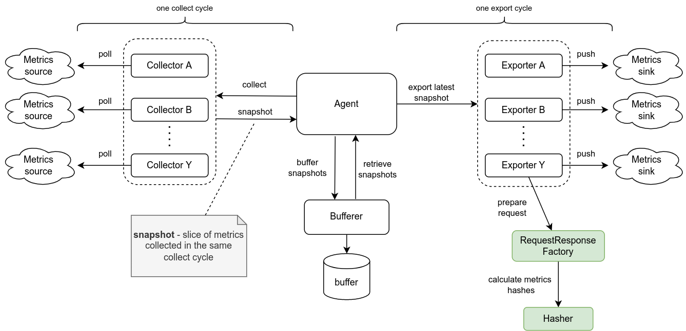
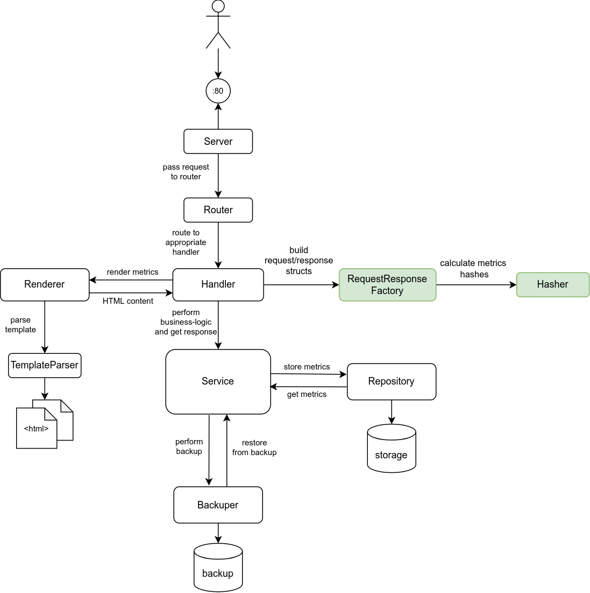

# Yandex Practicum Go DevOps
Учебный проект на [Яндекс Практикуме](https://practicum.yandex.ru/). Содержит реализацию сервиса по сбору и хранению метрик.

## Структура проекта

```
├── .github
├── cmd
│   ├── agent               Входная точка приложения для Агента
│   └── server              Входная точка приложения для Сервера
│
├── config                  Структуры конфига для разных компонентов, а также функции для их подгрузки
│
├── docs                    Дополнительная документация проекта
│   └── diagrams                Различные схемы и диаграммы
│
├── internal
│   ├── agent               Код агента, который собирает, буферизует и экспортирует метрики
│   │
│   ├── common              Shared компоненты, не относящиеся к конкретному пакету
│   │   ├── handlers            Общая функциональность обработчиков запросов, например проставление HTTP-заголовков
│   │   ├── logger              Функционал логирования, под капотом используется zerolog
│   │   ├── middleware          Различные middleware, использующиеся для конвейерной обработки HTTP-запросов
│   │   ├── routing             Роутер, используемый сервером и в handler-ах
│   │   ├── templating          Парсеры шаблонов, применяющие данные к каким-либо шаблонам 
│   │   ├── routing             Роутер, используемый сервером и в handler-ах
│   │   └── worker              Функциональность generic-воркера, используется коллекторами/эскпортерами метрик
│   │
│   ├── metrics             Пакет для работы с метриками, основной пакет в приложении
│   │   ├── backup              Компоненты, реализующие механизм backup/restore метрик, например на диск
│   │   ├── buffering           Компоненты, реализующие буферизацию метрик перед экспортированием
│   │   ├── collectors          Сборщики метрик, которыми пользуется агент
│   │   ├── delivery            Обработчики запросов, которые использует сервер
│   │   ├── domain              Доменные модели метрик и константы, использующиеся и агентом, и сервером
│   │   ├── exporters           Экспортеры метрик, которыми пользуется агент
│   │   ├── rendering           Компоненты, реализующие рендеринг метрик, например для отображения на HTML-страницах
│   │   ├── repository          Компоненты, реализующие хранение метрик, например в базе данных или памяти сервера
│   │   └── service             Компонент, реализующий основную бизнес-логику по работе с метриками,
│   │                                      предоставляет интерфейсы остальным компонентам
│   │
│   └── server              Код сервера, который запускает HTTP-сервер для приемки и агрегации метрик
│
└── web
    └── templates               Шаблоны для рендеринга HTML-страниц
```

## Диаграммы
Верхнеуровневая компонентная схема Агента:



Верхнеуровневая компонентная схема Сервера:



## Обновление шаблона

Чтобы получать обновления автотестов и других частей шаблона, выполните следующую команду:

```
git remote add -m main template https://github.com/yandex-praktikum/go-musthave-devops-tpl.git
```

Для обновления кода автотестов выполните команду:

```
git fetch template && git checkout template/main .github
```
